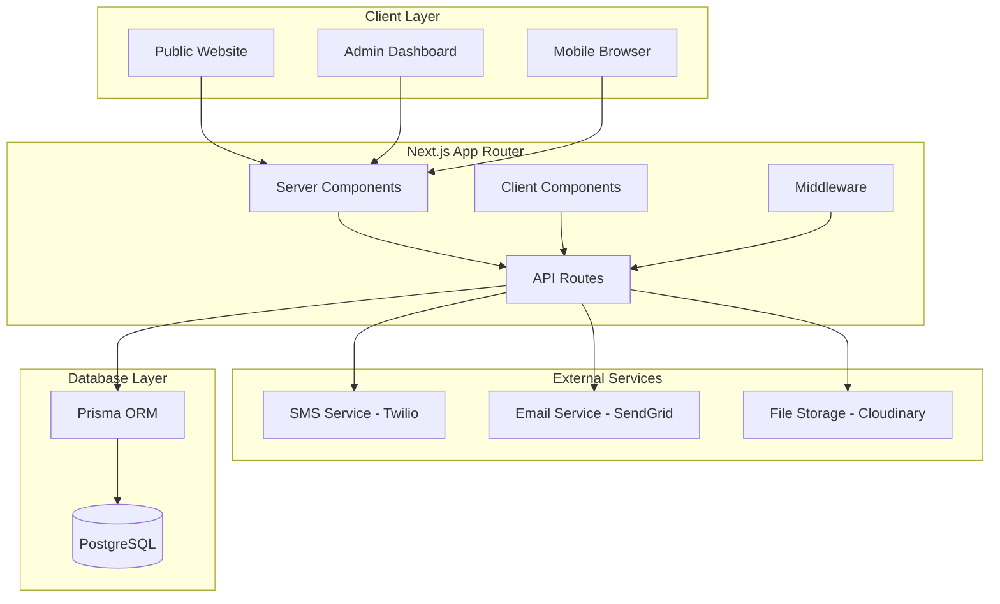
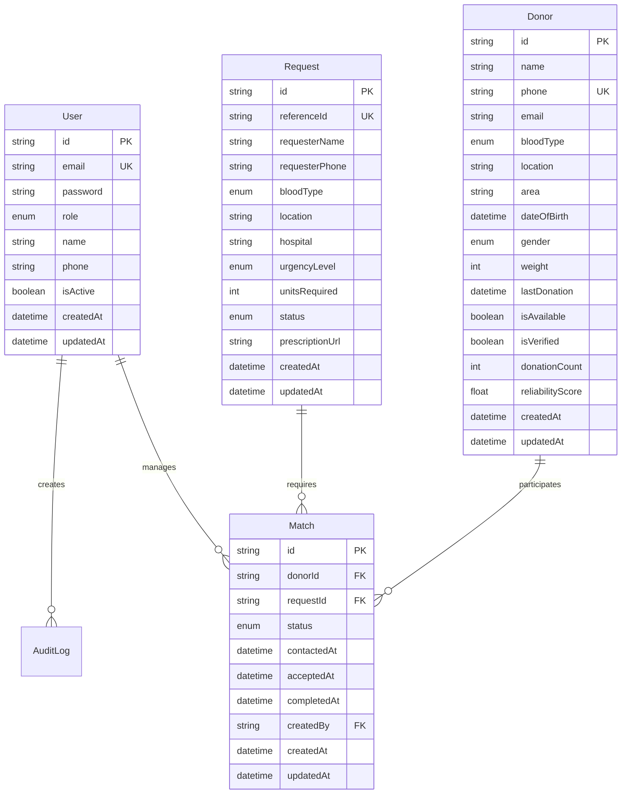

# Design Document

## Overview

RedAid is a blood donation platform built with Next.js 15 App Router, designed to connect blood donors with patients in need through a secure, efficient, and user-friendly interface. The system prioritizes donor privacy, admin efficiency, and seamless communication while maintaining high security standards and scalability.

The platform consists of three main user interfaces: a public-facing website for donors and requesters, an admin dashboard for staff management, and a comprehensive backend API for data management and business logic.

## Architecture

### High-Level Architecture



### Technology Stack

- **Frontend Framework**: Next.js 15 with App Router
- **UI Components**: shadcn/ui with Tailwind CSS
- **Database**: PostgreSQL with Prisma ORM
- **Authentication**: NextAuth.js v5
- **Styling**: Tailwind CSS with custom red theme
- **Form Management**: React Hook Form with Zod validation
- **File Storage**: Cloudinary for document uploads
- **Communication**: Twilio (SMS) and SendGrid (Email)
- **Deployment**: Vercel with Neon.tech database hosting

## Components and Interfaces

### Public Interface Components

#### Home Page (`app/page.tsx`)
- Hero section with mission statement and impact statistics
- Two primary CTAs: "Need Blood" and "Become a Donor"
- Real-time statistics dashboard (total donors, successful donations)
- Testimonials and success stories section
- Responsive design optimized for mobile-first approach

#### Blood Request Form (`app/request/page.tsx`)
- Multi-step form with progress indicator
- Fields: Name, Contact, Blood Type, Location, Hospital, Urgency Level, Required Units
- Optional prescription document upload (PDF, JPG, PNG up to 5MB)
- Real-time form validation with inline error messages
- Reference ID generation and confirmation display

#### Donor Registration Form (`app/donate/page.tsx`)
- Multi-step registration process with progress tracking
- Personal information: Name, Contact, Blood Type, Area, Date of Birth, Gender, Weight
- Medical eligibility questionnaire with conditional logic
- Availability preferences and privacy consent checkboxes
- Automatic eligibility calculation based on last donation date

### Admin Dashboard Components

#### Dashboard Layout (`app/(dashboard)/layout.tsx`)
- Sidebar navigation with role-based menu items
- Header with user profile, notifications, and logout
- Breadcrumb navigation for deep pages
- Responsive sidebar that collapses on mobile

#### Requests Management (`app/(dashboard)/requests/page.tsx`)
- Data table with sorting, filtering, and pagination
- Advanced filters: Blood Type, Location, Urgency, Date Range, Status
- Quick action buttons: Assign Donor, Mark Complete, Cancel
- Real-time status updates with color-coded badges
- Bulk operations support

#### Donor Database (`app/(dashboard)/donors/page.tsx`)
- Comprehensive donor profiles with search and filter capabilities
- Filter options: Blood type, Area, Availability, Last donation date, Eligibility
- Donor verification system with document review interface
- Quick view cards showing donor statistics and reliability scores
- Bulk export functionality

#### Matching System (`app/(dashboard)/matches/page.tsx`)
- Manual donor-request matching interface
- Distance calculation and eligibility checking
- Multi-donor assignment for large unit requirements
- Match confirmation workflow with status tracking
- Communication history and notes

### API Architecture

#### Authentication Routes (`app/api/auth/`)
- NextAuth.js configuration with credential provider
- Role-based access control middleware
- Session management with secure HTTP-only cookies
- Password reset and 2FA support

#### Core API Endpoints

**Donor Management**
```typescript
POST   /api/donors              // Register new donor
GET    /api/donors              // List/search donors (admin only)
GET    /api/donors/:id          // Get donor details
PUT    /api/donors/:id          // Update donor info
PATCH  /api/donors/:id/status   // Update availability status
DELETE /api/donors/:id          // Soft delete donor
```

**Request Management**
```typescript
POST   /api/requests            // Create blood request
GET    /api/requests            // List requests
GET    /api/requests/:id        // Get request details
PUT    /api/requests/:id        // Update request
PATCH  /api/requests/:id/status // Update status
```

**Matching System**
```typescript
POST   /api/matches             // Create donor-request match
GET    /api/matches             // List matches
PATCH  /api/matches/:id/status  // Update match status
POST   /api/matches/:id/contact // Record contact attempt
```

**Communication**
```typescript
POST   /api/notifications       // Send notifications
GET    /api/notifications       // Get user notifications
POST   /api/notifications/bulk  // Send bulk notifications
```

## Data Models

### Core Entities

#### User Model
```typescript
interface User {
  id: string
  email: string
  password: string // Hashed with bcrypt
  role: 'SUPER_ADMIN' | 'STAFF' | 'VIEWER'
  name: string
  phone?: string
  isActive: boolean
  createdAt: Date
  updatedAt: Date
}
```

#### Donor Model
```typescript
interface Donor {
  id: string
  name: string
  phone: string // Unique
  email?: string
  bloodType: BloodType
  location: string
  area: string
  address?: string
  dateOfBirth: Date
  gender: 'MALE' | 'FEMALE' | 'OTHER'
  weight: number
  lastDonation?: Date
  isAvailable: boolean
  isVerified: boolean
  donationCount: number
  reliabilityScore: number
  notes?: string
  createdAt: Date
  updatedAt: Date
  matches: Match[]
}
```

#### Request Model
```typescript
interface Request {
  id: string
  referenceId: string // Unique, user-facing ID
  requesterName: string
  requesterPhone: string
  requesterEmail?: string
  bloodType: BloodType
  location: string
  hospital: string
  urgencyLevel: 'CRITICAL' | 'URGENT' | 'NORMAL'
  unitsRequired: number
  status: 'PENDING' | 'IN_PROGRESS' | 'COMPLETED' | 'CANCELLED'
  notes?: string
  prescriptionUrl?: string
  completedAt?: Date
  cancelledAt?: Date
  createdAt: Date
  updatedAt: Date
  matches: Match[]
}
```

#### Match Model
```typescript
interface Match {
  id: string
  donor: Donor
  donorId: string
  request: Request
  requestId: string
  status: 'PENDING' | 'CONTACTED' | 'ACCEPTED' | 'REJECTED' | 'COMPLETED' | 'CANCELLED'
  contactedAt?: Date
  acceptedAt?: Date
  rejectedAt?: Date
  completedAt?: Date
  notes?: string
  createdBy: string // Admin user ID
  createdAt: Date
  updatedAt: Date
}
```

### Database Relationships



## Error Handling

### Client-Side Error Handling

#### Form Validation
- Real-time validation using Zod schemas
- Inline error messages with clear, actionable feedback
- Field-level validation on blur and form-level on submit
- Custom error boundaries for component-level error recovery

#### API Error Handling
```typescript
// Custom hook for API error handling
const useApiError = () => {
  const handleError = (error: ApiError) => {
    switch (error.status) {
      case 400:
        toast.error(error.message || 'Invalid request data')
        break
      case 401:
        toast.error('Please log in to continue')
        redirect('/login')
        break
      case 403:
        toast.error('You do not have permission to perform this action')
        break
      case 404:
        toast.error('The requested resource was not found')
        break
      case 500:
        toast.error('Server error. Please try again later.')
        break
      default:
        toast.error('An unexpected error occurred')
    }
  }
  
  return { handleError }
}
```

### Server-Side Error Handling

#### API Route Error Handling
```typescript
// Centralized error handler for API routes
export const handleApiError = (error: unknown): NextResponse => {
  console.error('API Error:', error)
  
  if (error instanceof ValidationError) {
    return NextResponse.json(
      { error: 'Validation failed', details: error.details },
      { status: 400 }
    )
  }
  
  if (error instanceof AuthenticationError) {
    return NextResponse.json(
      { error: 'Authentication required' },
      { status: 401 }
    )
  }
  
  if (error instanceof AuthorizationError) {
    return NextResponse.json(
      { error: 'Insufficient permissions' },
      { status: 403 }
    )
  }
  
  return NextResponse.json(
    { error: 'Internal server error' },
    { status: 500 }
  )
}
```

#### Database Error Handling
- Prisma error handling with custom error types
- Connection pooling and retry logic
- Transaction rollback on failures
- Graceful degradation for non-critical operations

## Testing Strategy

### Unit Testing
- **Framework**: Jest with React Testing Library
- **Coverage**: All utility functions, custom hooks, and business logic
- **Mocking**: Database operations, external API calls, and file uploads
- **Test Files**: Co-located with components (`*.test.tsx`)

### Integration Testing
- **API Routes**: Test all endpoints with various input scenarios
- **Database Operations**: Test CRUD operations and complex queries
- **Authentication Flow**: Test login, logout, and role-based access
- **Form Submissions**: Test complete form workflows

### End-to-End Testing
- **Framework**: Playwright for cross-browser testing
- **Critical Paths**: 
  - Donor registration and verification flow
  - Blood request submission and matching process
  - Admin dashboard operations
  - Communication workflows
- **Test Environment**: Staging environment with test data

### Performance Testing
- **Load Testing**: Simulate concurrent users and high request volumes
- **Database Performance**: Query optimization and indexing validation
- **File Upload Testing**: Large file handling and storage limits
- **Mobile Performance**: Touch interactions and responsive design

## Security Considerations

### Authentication and Authorization
- **Password Security**: bcrypt hashing with salt rounds
- **Session Management**: Secure HTTP-only cookies with CSRF protection
- **Role-Based Access**: Middleware-enforced permissions at API and UI levels
- **2FA Support**: TOTP-based two-factor authentication for admin accounts

### Data Protection
- **Encryption**: All sensitive data encrypted at rest and in transit
- **Input Validation**: Comprehensive sanitization using Zod schemas
- **SQL Injection Prevention**: Parameterized queries through Prisma ORM
- **XSS Protection**: React's built-in escaping and CSP headers

### Privacy Controls
- **Data Minimization**: Collect only necessary information
- **Access Logging**: Comprehensive audit trail for all data access
- **Data Retention**: Configurable retention policies with automated cleanup
- **User Consent**: Explicit opt-in for data processing and communications

### Infrastructure Security
- **HTTPS Enforcement**: All communications over secure connections
- **Rate Limiting**: API endpoint protection against abuse
- **Environment Variables**: Secure secret management
- **Regular Updates**: Automated dependency vulnerability scanning

## Performance Optimization

### Frontend Optimization
- **Code Splitting**: Dynamic imports for heavy components
- **Image Optimization**: Next.js Image component with WebP format
- **Lazy Loading**: Progressive loading of non-critical content
- **Caching**: Browser caching for static assets and API responses

### Backend Optimization
- **Database Indexing**: Strategic indexes on frequently queried fields
- **Connection Pooling**: Prisma connection pooling for efficient database access
- **Query Optimization**: Efficient joins and selective field loading
- **Caching Strategy**: Redis caching for frequently accessed data (Phase 2)

### Mobile Optimization
- **Responsive Design**: Mobile-first approach with touch-optimized interfaces
- **Progressive Web App**: Service workers for offline capabilities (Phase 2)
- **Reduced Bundle Size**: Tree shaking and minimal JavaScript payloads
- **Fast Loading**: Optimized images and critical CSS inlining

This design provides a solid foundation for building a secure, scalable, and user-friendly blood donation platform that meets all the requirements while maintaining high performance and security standards.